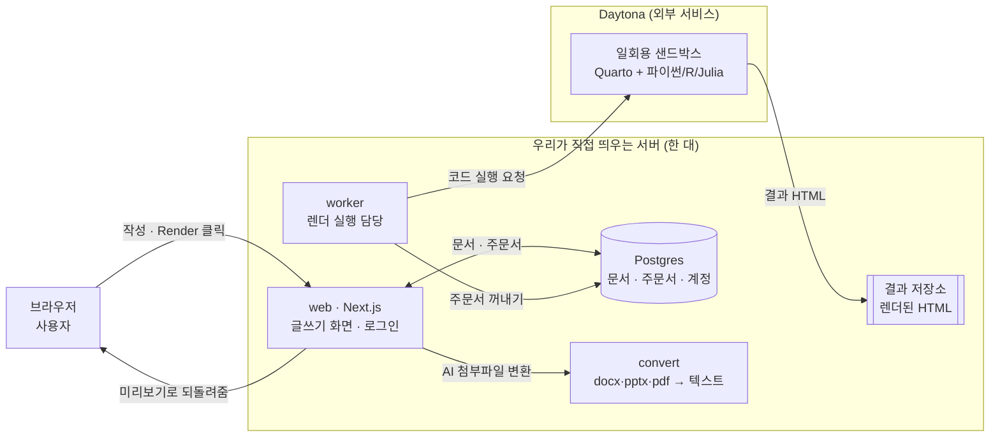
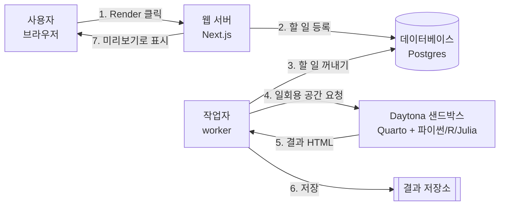

# Quarto Studio 쉽게 이해하기

이 문서는 Quarto를 한 번도 써본 적 없는 분을 위한 소개서예요.
"이게 대체 뭘 하는 물건인지"부터 시작해서, 어떤 원리로 돌아가는지까지 순서대로 설명합니다.
설치 방법은 다루지 않아요. 실제로 돌려보고 싶으시면 [QUICKSTART.md](../QUICKSTART.md)를 보시면 됩니다.

---

## 1. Quarto가 뭔가요?

**Quarto는 "글과 코드를 한 파일에 같이 쓰고, 그걸 하나의 문서로 만들어주는 도구"** 예요.

보통 데이터 분석 보고서를 쓴다고 하면 이런 과정을 거치죠.

1. 파이썬으로 그래프를 그린다
2. 그래프를 이미지 파일로 저장한다
3. 워드나 노션을 열어서 이미지를 붙여넣는다
4. 데이터가 바뀌면... 1번부터 다시 한다

Quarto는 이 과정을 없애줘요. 글 안에 그래프를 그리는 **코드를 그대로 적어두면**, Quarto가 그 코드를 직접 실행해서 결과 그래프를 문서에 끼워 넣어줍니다. 데이터가 바뀌어도 문서만 다시 만들면 그래프가 알아서 최신 상태가 되는 거예요.

이런 파일을 `.qmd`(Quarto Markdown) 파일이라고 부릅니다.

### .qmd 파일은 이렇게 생겼어요

아래는 이 프로젝트의 실제 예제([examples/10-r-boxplot.qmd](../examples/10-r-boxplot.qmd))를 줄인 거예요.

````markdown
---
title: "R 분포 차트"
format: html
---

## 히스토그램

내장 `iris` 데이터로 분포를 살펴봅니다.

```{r}
library(ggplot2)
ggplot(iris, aes(x = Sepal.Length, fill = Species)) +
  geom_histogram(binwidth = 0.3)
```
````

세 부분으로 나뉩니다.

| 부분 | 설명 |
| --- | --- |
| 맨 위 `---` 사이 | 문서 제목, 출력 형식 같은 설정. **프런트매터**라고 불러요. |
| 그냥 글 | 마크다운. 노션이나 깃허브 README와 같은 문법이에요. |
| ` ```{r} ` 블록 | **코드 청크**. 실제로 실행되는 코드입니다. |

핵심은 세 번째예요. 일반 마크다운에서 코드 블록은 그냥 "코드처럼 보이는 글자"일 뿐이지만, Quarto에서는 `{r}`이나 `{python}`처럼 중괄호가 붙으면 **진짜로 실행되고 그 결과(그래프, 표, 출력값)가 문서에 들어갑니다.**

---

## 2. 그럼 Quarto Studio는 뭔가요?

Quarto는 원래 **터미널에서 쓰는 도구**예요. 쓰려면 이 정도는 해야 합니다.

- 내 컴퓨터에 Quarto를 설치하고
- 파이썬, R, Julia 같은 언어와 필요한 라이브러리를 전부 설치하고
- 에디터로 `.qmd` 파일을 만들고
- 터미널에서 `quarto render` 명령을 치고
- 만들어진 HTML 파일을 브라우저로 열어본다

**Quarto Studio는 이걸 전부 웹 브라우저 안으로 옮긴 웹앱**이에요. 브라우저에서 접속해 회원가입하고, 왼쪽에 글을 쓰고, Render 버튼을 누르면 오른쪽에 결과가 뜹니다. 설치할 게 없어요.

여기에 몇 가지가 더 붙어 있어요.

- **AI 작성 도우미** — "여기에 막대그래프 추가해줘" 같은 요청으로 문서를 고칠 수 있어요. Claude, GPT 모델을 골라 쓸 수 있고, 워드·PPT·PDF 파일을 첨부해 참고 자료로 넘길 수도 있습니다.
- **한글 폰트 문제 해결** — 파이썬이나 R로 그래프를 그리면 한글이 `□□□`(두부, tofu라고 불러요)로 깨지는 게 아주 흔한데, 이 프로젝트는 그 문제를 해결해 뒀어요.
- **여러 사용자 지원** — 로그인해서 각자의 문서를 따로 관리합니다.

---

## 3. Quarto Studio는 어떤 조각들로 이루어져 있나요?

Quarto Studio는 하나의 프로그램이 아니라, 역할이 다른 **다섯 조각**이 서로 대화하는 구조예요.



각 조각이 하는 일이에요.

| 조각 | 하는 일 | 왜 따로 있나요 |
| --- | --- | --- |
| **web** | 브라우저에 보이는 전부. 에디터, 로그인, 미리보기 화면 | 사용자를 직접 상대하는 얼굴 |
| **Postgres** | 문서 내용, 렌더 주문서, 계정 정보를 저장하는 데이터베이스 | 서버가 꺼져도 데이터가 남아야 하니까 |
| **worker** | 주문서를 꺼내 실제 렌더링을 시키는 뒷단 일꾼 | 오래 걸리는 일을 web에서 떼어내려고 (자세한 건 5번에서) |
| **Daytona 샌드박스** | 코드를 실제로 실행하는 격리된 일회용 공간 | 남의 코드를 우리 서버에서 돌리면 위험하니까 (4번에서) |
| **convert** | AI에 첨부한 워드·PPT·PDF를 글자로 뽑아주는 보조 서비스 | 이 변환에만 별도 파이썬 도구가 필요해서 |

여기서 기억할 점 하나. **web과 worker는 서로 직접 대화하지 않아요.** 둘 다 데이터베이스만 쳐다봅니다. web은 "할 일"을 데이터베이스에 적고, worker는 데이터베이스에서 그걸 꺼내가요. 이렇게 해두면 worker가 잠깐 죽어도 주문서는 데이터베이스에 그대로 남아 있어서, 다시 살아났을 때 이어서 처리할 수 있습니다.

---

## 4. "코드를 실행한다"는 게 왜 어려운 문제인가요?

여기가 이 프로젝트에서 가장 중요한 부분이에요.

문서에 적힌 코드를 실행한다는 건, 곧 **남이 써준 코드를 내 서버에서 돌린다**는 뜻이에요. 만약 누군가 이런 코드를 문서에 적어두면 어떻게 될까요?

```python
# 서버의 비밀번호 파일을 읽어서 외부로 보내기
```

그래서 Quarto Studio는 코드를 **자기 서버에서 실행하지 않습니다.** 대신 **Daytona**라는 서비스에 "일회용 실행 공간"(샌드박스, sandbox)을 하나 빌려서 거기서 실행하고, 결과만 받아온 뒤 그 공간을 버려요.

### Daytona가 뭔가요?

[Daytona](https://www.daytona.io/)는 **AI가 만든 코드나 신뢰할 수 없는 코드를 안전하게 실행하기 위한 샌드박스를 빌려주는 서비스**예요. API로 "샌드박스 하나 만들어줘"라고 요청하면 수십 밀리초 만에 격리된 리눅스 환경이 하나 생기고, 거기에 파일을 올리고 명령어를 실행한 뒤, 다 쓰면 지워버릴 수 있습니다.

- 공식 사이트: <https://www.daytona.io/>
- 문서: [Daytona Docs](https://www.daytona.io/docs) · [시작 가이드](https://www.daytona.io/docs/en/getting-started)
- 대시보드(API 키 발급): <https://app.daytona.io>
- 소스 코드: [daytonaio/daytona (GitHub)](https://github.com/daytonaio/daytona)

직접 서버에 도커를 깔아서 비슷하게 만들 수도 있지만, 그러면 격리 설정·자원 제한·뒷정리를 전부 직접 관리해야 해요. 실제로 이 프로젝트도 **처음에는 도커로 만들었다가 Daytona로 갈아탔습니다.**

### 이 프로젝트가 Daytona를 쓰는 방식

worker가 렌더 요청 하나를 받으면 이런 순서로 일해요.

1. **스냅샷**으로 샌드박스를 만든다 — 스냅샷은 Quarto·파이썬·R·Julia·한글 폰트가 전부 설치된 상태를 통째로 찍어둔 이미지예요. 매번 설치할 필요 없이 복제만 하면 되니 빠릅니다. (이름: `quarto-render-1`)
2. 문서 파일(`index.qmd`)과 설정 파일을 샌드박스에 **올린다**
3. 그 안에서 `quarto render`를 **실행시킨다**
4. 만들어진 HTML을 **받아온다**
5. 샌드박스를 **삭제한다**

그리고 이 샌드박스에는 안전장치가 겹겹이 걸려 있어요.

| 장치 | 실제 설정 | 의미 |
| --- | --- | --- |
| 네트워크 완전 차단 | `networkBlockAll: true` | 그 안의 코드는 인터넷으로 아무것도 보내거나 받을 수 없어요 |
| 일회용 | 잡이 끝나면 즉시 `delete` | 문서 하나 렌더가 끝나면 공간 자체가 사라집니다 |
| 자원 상한 | 2 vCPU · 2GiB 메모리 · 10GiB 디스크 | 무한 루프를 돌려도 서버 전체가 죽지 않아요 |
| 시간 제한 | 기본 60초 (`QUARTO_RENDER_TIMEOUT_MS`) | 안 끝나면 worker가 강제로 중단시켜요 |
| 자동 정리 | `autoStopInterval: 5분` | worker가 죽어서 삭제를 놓쳐도 5분 뒤 알아서 꺼집니다 |
| 격리 | 호스트 밖에서 실행 | 우리 서버의 파일이나 데이터베이스에 손댈 수 없어요 |

시간 제한이 세 겹(Daytona 자체 타임아웃 + worker의 감시 타이머 + 샌드박스 자동 종료)으로 걸려 있는 게 보이시죠. 하나가 실패해도 나머지가 받아주게 해둔 거예요.

> [!NOTE]
> 네트워크를 막아둔 탓에 생긴 부작용도 있었어요. 문서를 만들 때 외부 폰트나 스크립트를 인터넷에서 받아오려다가, 응답이 없으니 **몇 초씩 기다리다 실패**하는 일이 생겼습니다. 그래서 지금은 외부에서 받아오는 것들을 아예 문서에서 걷어내고, 샌드박스 안의 DNS도 즉시 실패하도록 설정해 뒀어요.

### 그리고, 기본은 "실행 안 함"

**새 문서는 코드 실행이 꺼진 상태로 시작해요.** 켜야만 실행됩니다. 이걸 `executeCode` 설정이라고 부르는데, 껐을 때는 코드가 그냥 "예쁘게 표시된 글자"로만 남아요.

> [!WARNING]
> 아무리 격리돼 있어도, 코드 실행은 **내가 내용을 아는 문서에서만** 켜는 게 안전합니다.

---

## 5. 버튼을 누르면 안에서 무슨 일이 벌어지나요?

Render 버튼을 눌렀을 때의 흐름이에요.



말로 풀면 이렇습니다.

1. 사용자가 Render를 누르면, 웹 서버는 **바로 렌더링을 시작하지 않아요.** 대신 "이 문서 좀 렌더해줘"라는 **주문서를 데이터베이스에 적어둡니다.**
2. `worker`라는 별도의 프로그램이 그 주문서를 하나씩 꺼내 처리해요.
3. worker는 Daytona에 일회용 공간을 만들고, 문서를 올리고, `quarto render`를 실행시킵니다.
4. 결과 HTML을 받아서 저장하고, 공간을 삭제해요.
5. 브라우저는 그 사이 "지금 준비 중 / 코드 실행 중" 같은 진행 상태를 보여주다가, 결과가 나오면 오른쪽 미리보기에 띄웁니다.

### 왜 굳이 주문서를 거치나요?

**렌더링은 오래 걸릴 수 있기 때문이에요.** 그래프를 그리는 파이썬 코드가 30초 걸린다고 해서 웹 서버가 30초 동안 멈춰 있으면, 그동안 다른 사람은 아무것도 못 해요.

주문서를 남기고 바로 응답해버리면 웹 서버는 계속 가벼운 상태로 남고, 무거운 일은 worker가 뒤에서 처리합니다. 이런 구조를 **작업 큐(job queue)** 라고 불러요. 카페에서 주문받고 진동벨을 주는 것과 같습니다. 주문받는 사람과 커피 만드는 사람이 나뉘어 있는 거죠.

---

## 6. 한글이 깨지던 이유

파이썬이나 R로 그래프를 그리면 한글 제목이 `□□□`처럼 네모로 나오는 일이 아주 흔해요. 대부분 "한글 폰트가 없어서"라고 생각하는데, 이 프로젝트에서 파고들어 보니 **진짜 원인은 다른 데 있었습니다.**

리눅스 컨테이너는 기본적으로 **POSIX 로케일**이라는 설정을 쓰는데, 이건 "이 시스템은 영어 알파벳만 다룬다"는 뜻이에요. 폰트가 멀쩡히 설치돼 있어도, 시스템이 애초에 한글을 글자로 취급하지 않으니 그래프 라이브러리가 한글을 못 그리는 거죠.

그래서 해결책은 두 가지였어요.

1. 시스템 언어 설정(`LANG`, `LC_CTYPE`)을 UTF-8로 고정한다 — "이 시스템은 전 세계 문자를 다룬다"고 알려주는 것
2. 그래프 라이브러리(matplotlib, ggplot2, Plots)마다 기본 폰트를 `NanumGothic`으로 지정한다

이 설정들은 렌더링용 실행 환경([docker/render/](../docker/render/))에 미리 구워져 있어서, 사용자는 아무것도 안 해도 한글이 잘 나옵니다.

---

## 7. 쓸 수 있는 언어와 라이브러리

렌더링 환경에 미리 설치된 것들이에요. 이 목록에 없는 라이브러리는 (인터넷이 차단돼 있어서) 설치할 수 없습니다.

| 언어 | 라이브러리 | 코드 실행 |
| --- | --- | --- |
| **Python** | numpy, pandas, matplotlib, seaborn, plotly, altair, scikit-learn, scipy, statsmodels | 필요 |
| **R** | ggplot2, dplyr, tidyr, readr, knitr | 필요 |
| **Julia** | Plots, DataFrames | 필요 |
| **Markdown** (수식, Mermaid 다이어그램) | — | 불필요 |
| **Observable JS** | — | 불필요 (브라우저가 직접 실행) |

마지막 두 줄이 재미있어요. 수식이나 Mermaid 다이어그램, Observable JS 차트는 **서버에서 코드를 실행할 필요가 없어요.** 브라우저가 알아서 그려주기 때문에, 코드 실행을 꺼둔 채로도 잘 동작합니다.

각 언어별 예제는 [examples/](../examples/) 폴더에 14개가 들어 있어요.

---

## 8. 용어 정리

이 프로젝트 문서들을 읽다 보면 나오는 말들이에요.

| 용어 | 뜻 |
| --- | --- |
| **Quarto** | 글과 코드를 섞어 문서를 만드는 도구 |
| **.qmd** | Quarto가 읽는 파일 형식. 마크다운 + 실행 가능한 코드 |
| **렌더(render)** | `.qmd` 파일을 실제 HTML 문서로 변환하는 것 |
| **코드 청크(chunk)** | 문서 안의 실행 가능한 코드 블록. ` ```{python} ` 같은 형태 |
| **샌드박스(sandbox)** | 코드를 안전하게 격리해서 실행하는 일회용 공간 |
| **Daytona** | 그 샌드박스를 빌려주는 외부 서비스 ([공식 사이트](https://www.daytona.io/)) |
| **스냅샷(snapshot)** | Quarto·파이썬·R·폰트가 전부 설치된 상태를 통째로 저장해둔 것. 샌드박스는 이걸 복제해서 만들어져요 |
| **worker** | 렌더 주문서를 꺼내 실제 작업을 수행하는 뒷단 프로그램 |
| **아티팩트(artifact)** | 렌더 결과로 나온 HTML 파일 |
| **마이그레이션(migration)** | 데이터베이스에 표(테이블) 구조를 만드는 초기 작업 |

---

## 9. 다음으로 볼 문서

- 직접 돌려보고 싶다면 → [QUICKSTART.md](../QUICKSTART.md)
- 전체 구조와 설정값을 알고 싶다면 → [README.md](../README.md)
- 서버에 올려서 운영하고 싶다면 → [docs/DEPLOY.md](DEPLOY.md)
