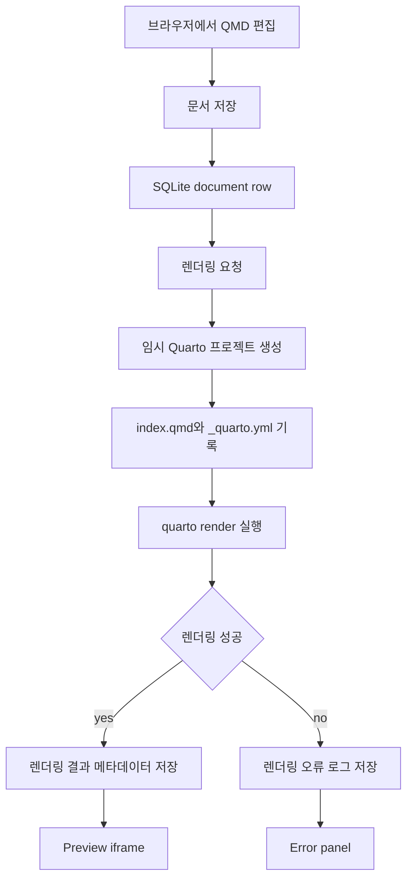

# Quarto Studio 설계

## 목표

Next.js 웹 인터페이스에서 Quarto Markdown 문서를 만들고, 편집하고, SQLite에 저장하고, Quarto로 렌더링한 뒤 미리보기할 수 있는 로컬 우선 문서 CMS 프로토타입을 만든다.

## 제품 형태

MVP는 3-pane 작업 공간을 사용한다.

- 왼쪽 pane: SQLite 기반 문서 목록과 상태 메타데이터.
- 가운데 pane: 선택한 문서의 QMD 에디터.
- 오른쪽 pane: iframe 형태의 Quarto HTML 렌더링 미리보기.

UI는 남색 계열의 IT 서비스 느낌을 지향한다. 진한 남색 topbar/sidebar, 또렷한 흰색 에디터/미리보기 작업면, 절제된 border, 밀도 있는 control, 주요 렌더링 액션을 위한 청록색 accent를 사용한다. 첫 화면은 마케팅 페이지가 아니라 실제 작업 중심의 문서 도구여야 한다.

## 아키텍처

Node 24 기반의 Next.js App Router를 사용한다. SQLite는 문서 메타데이터와 QMD 원문을 저장한다. 서버 액션 또는 route handler는 문서를 읽고 저장하며, 렌더링 요청이 들어오면 Quarto CLI를 실행한다. 각 렌더링은 격리된 임시 프로젝트 디렉토리를 만들고, 문서를 `index.qmd`로 기록하고, 최소 `_quarto.yml`을 생성한 뒤 `quarto render`를 실행한다. 이후 stdout/stderr를 수집하고, 렌더링 상태와 결과 HTML content를 저장해 미리보기에 사용한다.

## 데이터 모델

SQLite에는 `documents` 테이블을 둔다.

| Column | 역할 |
| --- | --- |
| `id` | 안정적인 문서 id. |
| `title` | 사용자가 읽을 수 있는 문서 제목. |
| `slug` | preview route에 사용할 URL-safe 식별자. |
| `content` | SQLite에 직접 저장되는 QMD 원문. |
| `execute_code` | Quarto 코드 실행 여부를 나타내는 boolean toggle. |
| `render_status` | `idle`, `rendering`, `success`, `error` 중 하나. |
| `rendered_html` | 마지막으로 성공한 렌더링 HTML content. 없으면 nullable. |
| `render_error` | 렌더링 실패 시 마지막 stderr/stdout 요약. |
| `created_at` | 생성 시각. |
| `updated_at` | 마지막 content 또는 metadata 수정 시각. |
| `rendered_at` | 마지막 성공 렌더링 시각. |

MVP에서는 SQLite만 사용한다. 인증, 다중 사용자 협업, 원격 publish 기능은 포함하지 않는다.

## Quarto 실행 정책

코드 실행은 기본적으로 비활성화한다. 각 문서는 명시적인 `execute_code` toggle을 가진다.

| Mode | 동작 |
| --- | --- |
| Code off | 실행을 비활성화한 상태로 문서를 렌더링한다. 새 문서의 기본값이다. |
| Code on | 신뢰된 로컬 실행을 전제로 `quarto render` 중 코드 실행을 허용한다. UI는 이 상태를 명확하게 표시해야 한다. |

이 MVP는 로컬 및 신뢰된 사용자 환경을 전제로 한다. 그래도 렌더링 작업은 임시 디렉토리 안에서 수행하고, 문서 간 stale file을 재사용하지 않도록 한다.

## UI 동작

첫 화면은 landing page가 아니라 실제 작성 작업 공간이다.

- 문서 목록은 제목, 렌더링 상태, 코드 실행 상태를 보여준다.
- 문서를 선택하면 해당 문서의 에디터와 마지막 preview를 불러온다.
- 저장은 title, slug, content, execution mode를 영속화한다.
- 렌더링은 현재 문서를 먼저 저장한 뒤 Quarto를 실행한다.
- preview pane은 마지막으로 성공한 HTML 렌더링 결과를 보여준다.
- 렌더링 실패 시 읽기 쉬운 error panel을 보여주되, 기존 성공 preview가 있으면 그것을 덮어쓰지 않는다.
- topbar에는 제품 identity, Node 24/runtime 상태, 저장 상태, 렌더링 액션을 배치한다.

## 오류 처리

| 실패 상황 | 사용자에게 보여줄 동작 |
| --- | --- |
| SQLite read/write 실패 | 작업 공간에 간결한 오류 메시지를 보여주고 에디터 content는 유지한다. |
| Quarto CLI 없음 | Quarto가 설치되어 있고 `PATH`에서 실행 가능해야 한다는 setup 안내를 보여준다. |
| 렌더링 timeout | 렌더링 상태를 error로 표시하고 timeout 상세를 보여준다. |
| 렌더링 stderr/stdout error | 수집한 log를 저장하고 표시한다. |
| 빈 문서 content | 저장은 허용한다. 렌더링은 최소 Quarto page를 만들거나, Quarto가 거부하면 명확한 validation message를 보여준다. |

## 테스트 전략

JavaScript/TypeScript 기반 React 프로젝트이며 Vite 호환 생태계이므로 Vitest를 사용한다. 테스트는 source module을 직접 import해야 하며 VM 또는 transpile 우회 방식은 사용하지 않는다.

초기 테스트 대상은 다음과 같다.

- SQLite document repository: create, update, list, fetch 동작.
- Quarto render command builder: 실행 허용/비허용 option 구성.
- Render service: injectable process execution을 사용한 success/failure result mapping.
- UI smoke test: core module이 생긴 뒤 문서 선택, 저장 상태, 렌더링 오류 표시를 확인.

테스트 편의를 위해 production-only 함수를 새로 만들지 않는다.

## 구현 범위

MVP에 포함한다.

- Node 24 기준 Next.js App Router 프로젝트.
- SQLite 기반 문서 영속화.
- 첫 실행용 seed document.
- 3-pane 남색 IT 서비스 UI.
- QMD 편집, 저장, 렌더링, preview.
- 문서 단위 코드 실행 toggle.
- core persistence와 render 동작에 대한 Vitest coverage.

이번 MVP에서 제외한다.

- 인증과 권한.
- 다중 사용자 협업.
- cloud deployment hardening.
- full WYSIWYG editing.
- PDF/Word export.
- background job queue.
- publishing workflow.

## 확정된 결정

- Layout: 3-pane workspace.
- Visual direction: 읽기 쉬운 흰색 작업면을 가진 남색 IT service UI.
- Storage: SQLite가 문서 원문과 metadata를 저장.
- Render model: 임시 프로젝트 디렉토리를 사용하는 server-side Quarto CLI 실행.
- Code execution: 기본 비활성화, 문서 단위 opt-in.
- Runtime: Node 24.
