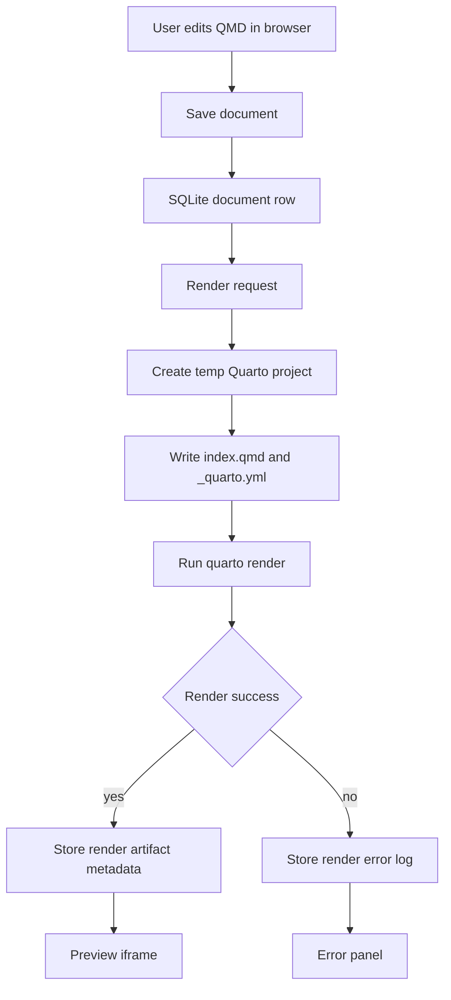

# Quarto Studio Design

## Goal

Build a local-first document CMS prototype where users can create, edit, store, render, and preview Quarto Markdown documents from a Next.js web interface.

## Product Shape

The MVP uses a three-pane workspace:

- Left pane: SQLite-backed document list with status metadata.
- Center pane: QMD editor for the selected document.
- Right pane: rendered Quarto HTML preview in an iframe-style surface.

The UI should feel like a navy-toned IT service: dark navy shell and sidebar, crisp white editor/preview surfaces, restrained borders, compact controls, and teal accents for primary render actions. It should be a work-focused document tool rather than a marketing page.

## Architecture

Use Next.js App Router on Node 24. SQLite stores document metadata and QMD source. Server-side actions or route handlers read and write documents, then run the Quarto CLI for render requests. Each render creates an isolated temporary project directory, writes the document as `index.qmd`, generates a minimal `_quarto.yml`, runs `quarto render`, captures output, and stores render status plus the resulting HTML path or HTML content for preview.

## Data Model

SQLite should contain a `documents` table:

| Column | Purpose |
| --- | --- |
| `id` | Stable document id. |
| `title` | Human-readable document title. |
| `slug` | URL-safe identifier for preview routes. |
| `content` | QMD source stored directly in SQLite. |
| `execute_code` | Boolean toggle for Quarto code execution. |
| `render_status` | `idle`, `rendering`, `success`, or `error`. |
| `rendered_html` | Last successful rendered HTML content or nullable if absent. |
| `render_error` | Last render stderr/stdout summary when render fails. |
| `created_at` | Creation timestamp. |
| `updated_at` | Last content or metadata update timestamp. |
| `rendered_at` | Last successful render timestamp. |

For the MVP, SQLite is enough. No auth, multi-user collaboration, or remote publishing is included.

## Quarto Execution Policy

Code execution is disabled by default. Each document has an explicit `execute_code` toggle.

| Mode | Behavior |
| --- | --- |
| Code off | Render the document with execution disabled. This is the default for new documents. |
| Code on | Allow trusted local execution during `quarto render`. The UI must label this state clearly. |

This MVP is local and trusted-user oriented. It should still keep render work inside temporary directories and avoid reusing stale files between documents.

## UI Behavior

The first screen is the actual authoring workspace, not a landing page.

- The document list shows title, render state, and code execution state.
- Selecting a document loads its editor and last preview.
- Save persists title, slug, content, and execution mode.
- Render persists the current document first, then runs Quarto.
- The preview pane shows the last successful HTML render.
- Failed renders show a readable error panel without replacing the last successful preview unless no preview exists.
- The top bar includes product identity, Node 24/runtime status, save state, and render action.

## Error Handling

| Failure | User-facing behavior |
| --- | --- |
| SQLite read/write failure | Show a compact error message in the workspace and keep the editor content visible. |
| Quarto CLI missing | Show setup guidance that Quarto must be installed and available on `PATH`. |
| Render timeout | Mark render as error and show timeout details. |
| Render stderr/stdout error | Store and display the captured log. |
| Empty document content | Save is allowed; render should produce a minimal Quarto page or a clear validation message if Quarto rejects it. |

## Testing Strategy

Use Vitest because this is a Vite-compatible TypeScript/React project ecosystem and the project will use JavaScript/TypeScript. Tests should import source modules directly and avoid VM or transpile bypasses.

Initial test targets:

- SQLite document repository: create, update, list, and fetch behavior.
- Quarto render command builder: execution-enabled and execution-disabled options.
- Render service: success and failure result mapping using injectable process execution.
- UI smoke tests for document selection, save state, and render error display after the core modules exist.

Tests should not introduce production-only functions for test convenience.

## Implementation Boundaries

Included in the MVP:

- Next.js App Router project configured for Node 24.
- SQLite-backed document persistence.
- Seed document for first run.
- Three-pane navy IT service UI.
- QMD editing, saving, rendering, and previewing.
- Document-level code execution toggle.
- Vitest coverage for core persistence and render behavior.

Deferred:

- Authentication and permissions.
- Multi-user collaboration.
- Cloud deployment hardening.
- Full WYSIWYG editing.
- PDF/Word export.
- Background job queue.
- Publishing workflow.

## Open Decisions Resolved

- Layout: three-pane workspace.
- Visual direction: navy IT service UI with readable white work surfaces.
- Storage: SQLite stores document source and metadata.
- Render model: server-side Quarto CLI invocation using temporary project directories.
- Code execution: disabled by default, document-level opt-in.
- Runtime: Node 24.

